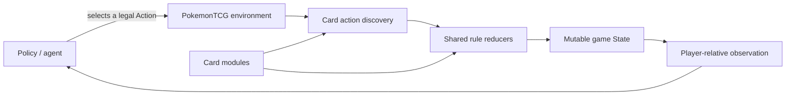

# ptcg-engine

[](https://github.com/gemelom/ptcg-engine/actions/workflows/ci.yml)
[](https://www.python.org/downloads/)
[](LICENSE)
[](#project-status)

A deterministic, headless Python engine for simulating Pokémon Trading Card Game
matches.

## Quick Start

Requires Python 3.12+ and [uv](https://docs.astral.sh/uv/).

```bash
git clone https://github.com/gemelom/ptcg-engine.git
cd ptcg-engine
uv tool install --editable .
```

Then start a match:

```
ptcg play
```

## Interactive CLI

Play as Player 1 against the built-in random or first-action policy:

```bash
ptcg play \
  --deck charizard_ex \
  --opponent-deck miraidon_ex \
  --opponent-policy random \
  --seed 42
```

The interactive command loop shows a player-safe board, your hand, recent public
events, and the currently legal actions. Enter an action number to play it. Card
selection prompts use candidate numbers separated by spaces or commas.

| Command | Purpose |
| --- | --- |
| `<number>` | Execute a legal action |
| `<n1> <n2>` | Select one or more card candidates when prompted |
| `board` / `hand` | Reprint the public board or your hand |
| `inspect <area> <number>` | Show public card details |
| `help` | Show the complete command reference |
| `quit` | Confirm and leave the current game |

The opponent's hand and all deck and Prize identities remain hidden. Opponent
actions advance automatically until the next human decision. Interactive games do
not support undo or resuming an unfinished match; `--record` saves an aborted event
log when a recorded game is stopped early.

## Python API

```python
from ptcg import PokemonTCG

env = PokemonTCG(seed=42, deck1="charizard_ex", deck2="miraidon_ex")
observation, reward, done, info = env.reset()

while not done:
    legal_actions = info["raw_available_actions"]
    action = legal_actions[0]  # replace with your policy or agent
    observation, reward, done, info = env.step(action)

print("Winner:", info["winner"])
```

The environment follows a compact Gym-like contract:

| API | Purpose |
| --- | --- |
| `reset()` | Start a game and return `(observation, reward, done, info)` |
| `step(action)` | Apply one legal action and return the next transition |
| `info["raw_available_actions"]` | Inspect the currently legal engine action objects |
| `observation` | Read a detached, player-relative view with hidden information masked |

For engine debugging only, `PokemonTCG(expose_full_state=True)` adds the mutable
`State` object to `info["full_state"]`. Do not enable it for agents that must respect
hidden information.

## How It Works



Cards declare attacks, abilities, and currently legal actions. Shared reducers perform
zone moves, attacks, knockouts, prizes, choices, retreat, evolution, turn transitions,
and termination. Multi-step choices pause through Python generators, which keeps card
logic explicit without coupling it to a UI or network protocol.

## Included Deck Fixtures

Bundled deck fixtures live in `src/ptcg/decks` and can be selected by name:

- `charizard_ex`
- `gholdengo_ex`
- `miraidon_ex`
- `lugia_archeops`
- `gardevori_ex`

You can also pass a deck text file directly:

```bash
ptcg --deck1 ./my_deck.txt --deck2 charizard_ex --seed 7
```

Decks are validated before setup so malformed lists fail with actionable errors.

## Contributing

Contributions are welcome. High-impact places to help include:

- implementing a missing card with direct rule tests;
- reproducing and fixing edge-case interactions;
- adding state invariants, property tests, or long-game simulations;
- extending static typing from the core into cards and utilities;
- improving examples, API documentation, and integrations.

## License and Disclaimer

The source code is available under the [MIT License](LICENSE).

This is an unofficial fan/developer project. It is not affiliated with, endorsed by, or
sponsored by Nintendo, The Pokémon Company, Creatures, or Game Freak. Pokémon and
Pokémon TCG are trademarks of their respective owners.
