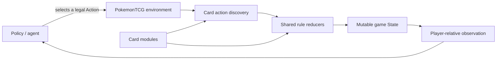

# ptcg-engine

[](https://github.com/gemelom/ptcg-engine/actions/workflows/ci.yml)
[](https://www.python.org/downloads/)
[](LICENSE)
[](#project-status)

A deterministic, headless Python engine for simulating Pokémon Trading Card Game
matches. It exposes explicit actions and player-safe observations for rules testing,
bot development, self-play, and reproducible experiments.

> The goal is a small, inspectable engine whose game transitions can be tested one
> rule at a time—not a graphical client or a replacement for the official game.

## Why ptcg-engine?

- **Reproducible simulations** — each environment owns its seeded random-number
  generator, so parallel games do not interfere with one another.
- **Inspectable decisions** — legal moves are first-class action objects rather than
  opaque integer IDs.
- **Safe agent inputs** — observations hide the opponent's hand and all deck and Prize
  identities while retaining a debugging-only full-state mode.
- **Testable card rules** — card behavior lives in focused modules with rule-specific
  pytest coverage metadata.
- **Lightweight integration** — the package has one runtime dependency and a Gym-like
  `reset()` / `step()` interface.

## Quick Start

Requires Python 3.12+ and [uv](https://docs.astral.sh/uv/).

```bash
git clone https://github.com/gemelom/ptcg-engine.git
cd ptcg-engine
uv sync --frozen --all-groups
uv run ptcg --deck1 charizard_ex --deck2 miraidon_ex --seed 42 --policy random --quiet
```

You can also use the module entry point:

```bash
uv run python -m ptcg --quiet --seed 42
```

## Python API

```python
from ptcg import PokemonTCG

env = PokemonTCG(seed=42, deck1="charizard_ex", deck2="miraidon_ex")
observation, reward, done, info = env.reset()

while not done:
    legal_actions = info["raw_available_actions"]
    action = legal_actions[0]  # replace with your policy or agent
    observation, reward, done, info = env.step(action)

print("Winner:", info["winner"])
```

The environment follows a compact Gym-like contract:

| API | Purpose |
| --- | --- |
| `reset()` | Start a game and return `(observation, reward, done, info)` |
| `step(action)` | Apply one legal action and return the next transition |
| `info["raw_available_actions"]` | Inspect the currently legal engine action objects |
| `observation` | Read a detached, player-relative view with hidden information masked |

For engine debugging only, `PokemonTCG(expose_full_state=True)` adds the mutable
`State` object to `info["full_state"]`. Do not enable it for agents that must respect
hidden information.

## How It Works



Cards declare attacks, abilities, and currently legal actions. Shared reducers perform
zone moves, attacks, knockouts, prizes, choices, retreat, evolution, turn transitions,
and termination. Multi-step choices pause through Python generators, which keeps card
logic explicit without coupling it to a UI or network protocol.

## Included Deck Fixtures

Bundled deck fixtures live in `src/ptcg/decks` and can be selected by name:

- `charizard_ex`
- `gholdengo_ex`
- `miraidon_ex`
- `lugia_archeops`
- `gardevori_ex`

You can also pass a deck text file directly:

```bash
uv run ptcg --deck1 ./my_deck.txt --deck2 charizard_ex --seed 7
```

Decks are validated before setup so malformed lists fail with actionable errors.

## Project Layout

```text
src/ptcg/
├── core/       # state, actions, reducers, environments, rewards, recording
├── cards/      # card implementations grouped by expansion
├── decks/      # bundled deck fixtures
├── utils/      # loading, validation, rule helpers
└── cli.py      # headless game runner

tests/
├── cards/      # rule-focused card tests
└── test_*.py   # engine contracts and integration tests
```

The repository intentionally contains only the engine. Training agents, benchmark
runners, backend services, and frontend applications belong in separate packages that
consume its public API.

## Development

The local commands below match the automated CI quality gates:

| Command | Checks |
| --- | --- |
| `uv sync --frozen --all-groups` | Install the locked development environment |
| `uv run pytest` | Run the complete test suite |
| `uv run pytest --cov=ptcg` | Measure line coverage |
| `uv run python scripts/card_test_coverage.py --fail-on-unknown` | Report rule-focused card coverage |
| `uv run ruff check .` | Run lint checks |
| `uv run ruff format --check .` | Verify formatting |
| `uv run mypy` | Type-check the core engine |
| `uv run pip-audit` | Audit installed dependencies |
| `uv build` | Build the source distribution and wheel |

Pull requests must retain at least 90% line coverage. Card coverage is reported
separately because executing a line is not the same as proving a card interaction.

## Contributing

Contributions are welcome. High-impact places to help include:

- implementing a missing card with direct rule tests;
- reproducing and fixing edge-case interactions;
- adding state invariants, property tests, or long-game simulations;
- extending static typing from the core into cards and utilities;
- improving examples, API documentation, and integrations.

Read [CONTRIBUTING.md](CONTRIBUTING.md) for engine invariants, the card implementation
checklist, and the full pre-PR quality gate. If you are unsure where a change belongs,
[open an issue](https://github.com/gemelom/ptcg-engine/issues/new) with the card text,
rule question, or minimal reproduction.

## Roadmap

- Strengthen state invariants and property-based testing.
- Expand static type coverage across cards and utilities.
- Broaden the supported card pool and complex interaction coverage.
- Stabilize observation and action serialization for external agents.
- Define a compatibility policy before the first stable release.

## Project Status

`ptcg-engine` is alpha software. It can run deterministic games with the bundled decks,
but the supported rule surface is limited to cards implemented under `src/ptcg/cards`.
Card-specific coverage proves the behaviors named by those tests; it is not a claim of
complete Pokémon TCG rules conformance. Public APIs may evolve while the engine moves
toward a stable release.

## License and Disclaimer

The source code is available under the [MIT License](LICENSE).

This is an unofficial fan/developer project. It is not affiliated with, endorsed by, or
sponsored by Nintendo, The Pokémon Company, Creatures, or Game Freak. Pokémon and
Pokémon TCG are trademarks of their respective owners.
